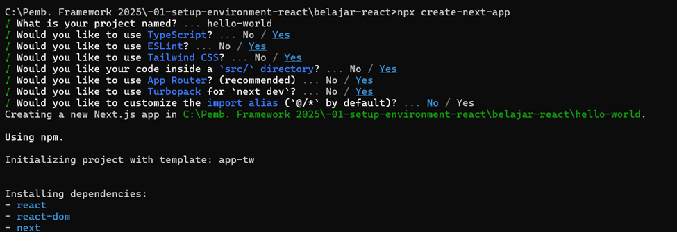
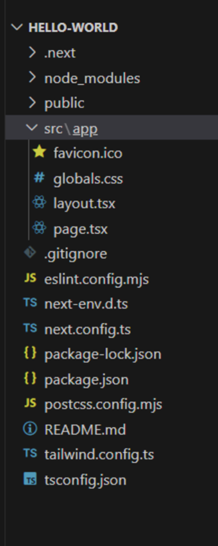
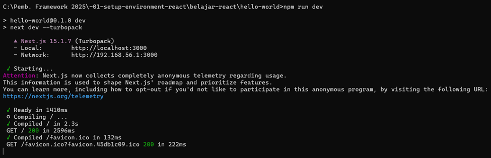
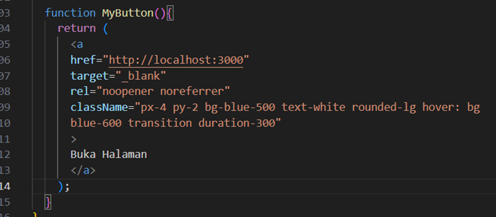
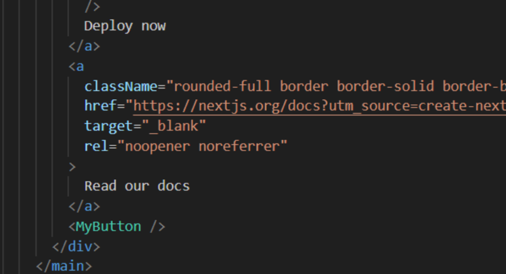
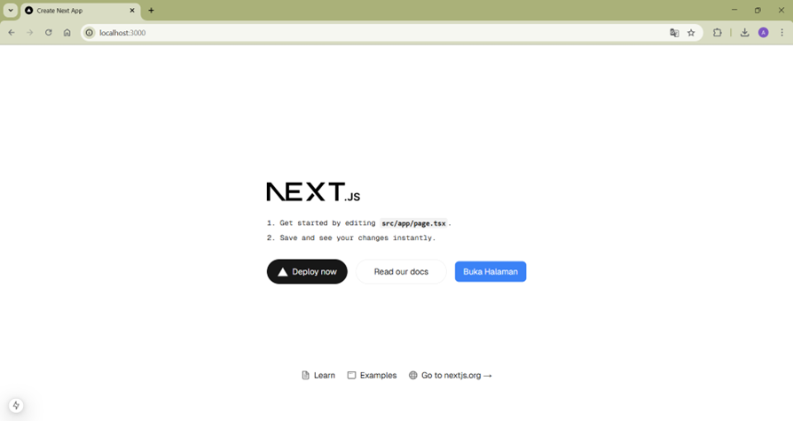
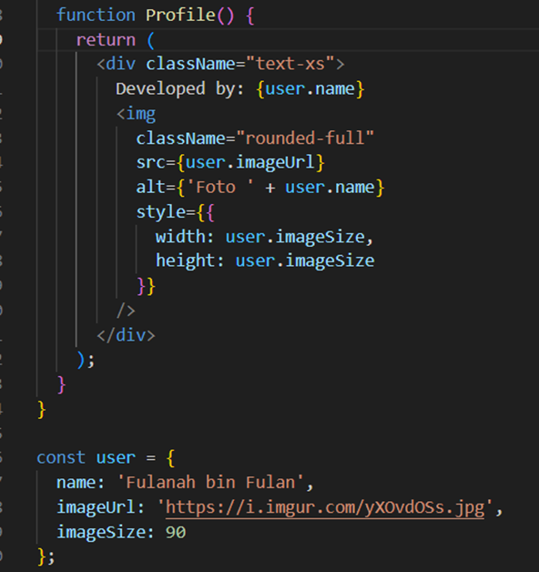
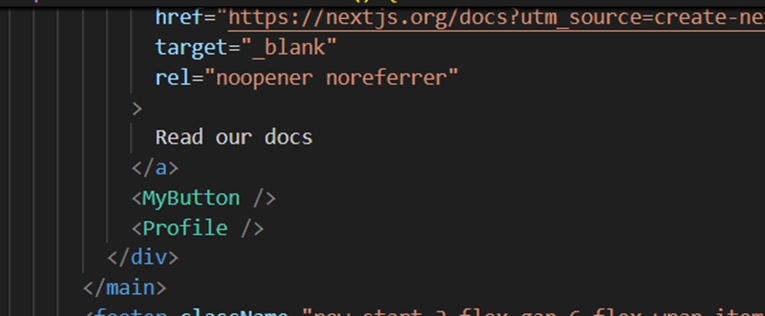
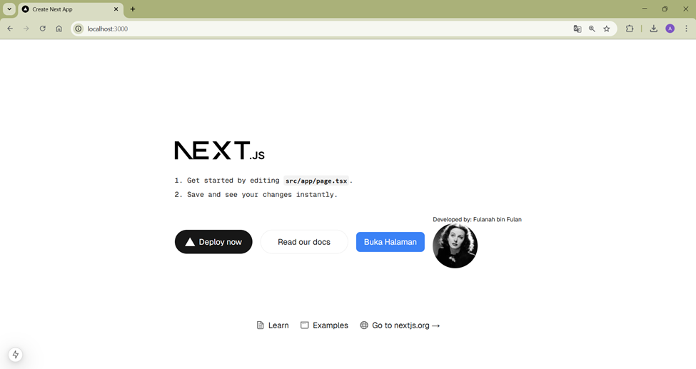

|        |   Pemrograman Berbasis Framework   |
|--------|------------------------------------|
|Nama    | Astrid Risa Widiana                |
|NIM     | 2241720250                         |
|Kelas   | TI-3A                              |
|Absen   | 05                                 |

# **JOBSHEET 1 - PENGANTAR PEMROGRAMAN BERBASIS FRAMEWORK DAN REACTJS**
## **Praktikum 1 : Menyiapkan Lingkungan Pengembangan**
### **Pertanyaan Praktikum 1** 

1. Jelaskan kegunaan masing-masing dari Git, VS Code dan NodeJS yang telah Anda install pada sesi praktikum ini! 

    **Jawab:**

    > Git → Digunakan untuk mengelola versi kode, menyimpan riwayat perubahan, dan berkolaborasi melalui GitHub.

    > VS Code → Editor kode dengan fitur debugging, syntax highlighting, dan integrasi Git untuk pengembangan lebih efisien.
    
    > Node.js → Runtime untuk menjalankan JavaScript di luar browser serta mengelola dependencies dengan npm.

2. Buktikan dengan screenshoot yang menunjukkan bahwa masing-masing tools tersebut telah berhasil terinstall di perangkat Anda!

    **Bukti :**

    **Git**

    

    **VSCode**

    

    **Node.js**

    

## **Praktikum 2: Membuat Proyek Pertama React Menggunakan Next.js**
1. Membuat folder proyek baru dengan nama belajar-react. Melalui konsol/command prompt/CMD masuk ke dalam folder tersebut dan jalankan perintah ini: **npx create-next-app** 

2. Buat proyek baru dengan nama hello-world seperti di bawah ini. Nama proyek ini perlu dimasukkan pertama kali melalui konsol.

3. Buka folder proyek hello-world menggunakan VS Code. Masuk ke dalam folder proyek hello world dengan perintah: **cd hello-world** 
Kemudian setelah masuk ke folder hello-world, masukkan perintah: **code .** Maka VS Code akan membuka project react Anda yang telah dibuat bernama hello-world. Dan akan menampilkan struktur folder proyek seperti di bawah ini.

    

4. Running proyek hello-world dengan memasukkan perintah di bawah ini melalui konsol atau terminal di dalam VS Code. 
**npm run dev** 
Tunggu proses kompilasi hingga selesai. Lalu Anda dapat membuka alamat localhost di browser: [http://localhost:3000/ ](https://)

Jika di browser telah tampil seperti gambar berikut ini, **Selamat!**
.png)

### **Pertanyaan Praktikum 2** 
1. Pada Langkah ke-2, setelah membuat proyek baru menggunakan Next.js, terdapat beberapa istilah yang muncul. Jelaskan istilah tersebut, TypeScript, ESLint, Tailwind CSS, App Router, Import alias, App router, dan Turbopack!

    **Jawab:**
    > 1. TypeScript → Bahasa pemrograman berbasis JavaScript dengan fitur tipe data statis untuk kode lebih aman dan terstruktur.
    > 2. ESLint → Alat untuk mendeteksi dan memperbaiki kesalahan dalam kode JavaScript atau TypeScript sesuai standar yang ditentukan.
    > 3. Tailwind CSS → Framework CSS berbasis utility class untuk styling yang lebih cepat dan fleksibel.
    > 4. App Router → Sistem routing baru di Next.js yang menggunakan folder app/ dengan pendekatan berbasis file.
    > 5. Import Alias → Cara memberi nama pendek untuk jalur impor file agar lebih rapi dan mudah dikelola.
    > 6. Turbopack → Bundler baru di Next.js yang lebih cepat dibanding Webpack untuk mempercepat proses pengembangan.

2. Apa saja kegunaan folder dan file yang ada pada struktur proyek React yang tampil pada gambar pada tahap percobaan ke-3!

    **Jawab:**
    > 1. Folder .next → Folder build yang dibuat otomatis oleh Next.js untuk menyimpan hasil kompilasi.
    > 2. Folder node_modules → Berisi dependensi proyek yang diinstal melalui npm atau yarn.
    > 3. Folder public → Tempat menyimpan aset statis seperti gambar, ikon, atau font.
    > 4. Folder src/app → Folder utama untuk halaman dan komponen Next.js dengan App Router.
    > 5. favicon.ico → Ikon kecil untuk tab browser.
    > 6. globals.css → File CSS global untuk styling seluruh proyek.
    > 7. layout.tsx → File utama untuk struktur tata letak aplikasi.
    > 8. page.tsx → File utama untuk halaman awal (home).
    > 9. File .gitignore → Menentukan file atau folder yang tidak akan di-track oleh Git.
    > 10. File eslint.config.mjs → Konfigurasi ESLint untuk memastikan kualitas kode.
    > 11. File next-env.d.ts → Deklarasi tipe untuk proyek Next.js dengan TypeScript.
    > 12. File next.config.ts → Konfigurasi tambahan untuk proyek Next.js.
    > 13. File package-lock.json → Mengunci versi dependensi agar tetap konsisten.
    > 14. File package.json → Berisi informasi proyek dan daftar dependensi.
    > 15. File postcss.config.mjs → Konfigurasi PostCSS untuk memproses CSS.
    > 16. File README.md → Dokumentasi proyek.
    > 17. File tailwind.config.ts → Konfigurasi untuk Tailwind CSS.
    > 18. File tsconfig.json → Konfigurasi untuk TypeScript dalam proyek ini.

    
3. Buktikan dengan screenshoot yang menunjukkan bahwa tahapan percobaan di atas telah berhasil Anda lakukan!

## **Praktikum 3: Menambahkan Komponen React (Button)** 
1. Di dalam folder proyek yang telah dibuka di VS Code, buka file page.tsx 

2. Tambahkan fungsi MyButton yang mengembalikan markup komponen button yang akan ditambahkan ke dalam webpage
 

3. Tambahkan komponen button tersebut di samping button Read Our Docs.

Perhatikan bahwa komponen MyButton dimulai dengan huruf kapital. Dengan cara itulah 
Anda mengetahui bahwa itu adalah sebuah komponen React. Nama komponen React harus 
selalu dimulai dengan huruf kapital, sedangkan tag HTML harus menggunakan huruf kecil. 
Kata kunci export default menentukan komponen utama di dalam berkas (file).  

4. Simpan perubahan dan coba lihat perubahan melalui web browser!

### **Pertanyaan Praktikum 3** 
1. Buktikan dengan screenshoot yang menunjukkan bahwa tahapan percobaan di atas telah berhasil Anda lakukan! 

## **Praktikum 4: Menulis Markup dengan JSX** 
1. Tambahkan kode JSX di bawah ini ke dalam file page.tsx.

2. Tambahkan komponen MyProfile setelah kompnen MyButton.

3. Simpan dan amati perubahan di halaman web yang dihasilkan!

### **Pertanyaan Praktikum 4** 
1. Untuk apakah kegunaan sintaks user.imageUrl?

    **Jawab:**
    
    Sintaks user.imageUrl digunakan untuk mengakses properti imageUrl dari objek user, pada kode program praktikum 4 sintaks ini digunakan untuk mendapatkan URL gambar profil pengguna.

2. Buktikan dengan screenshoot yang menunjukkan bahwa tahapan percobaan di atas telah berhasil Anda lakukan! 